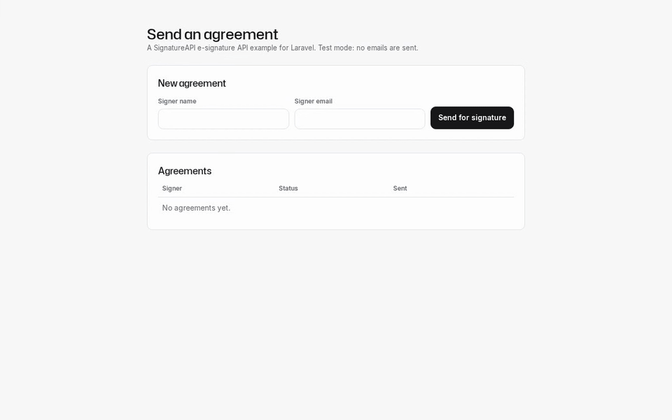
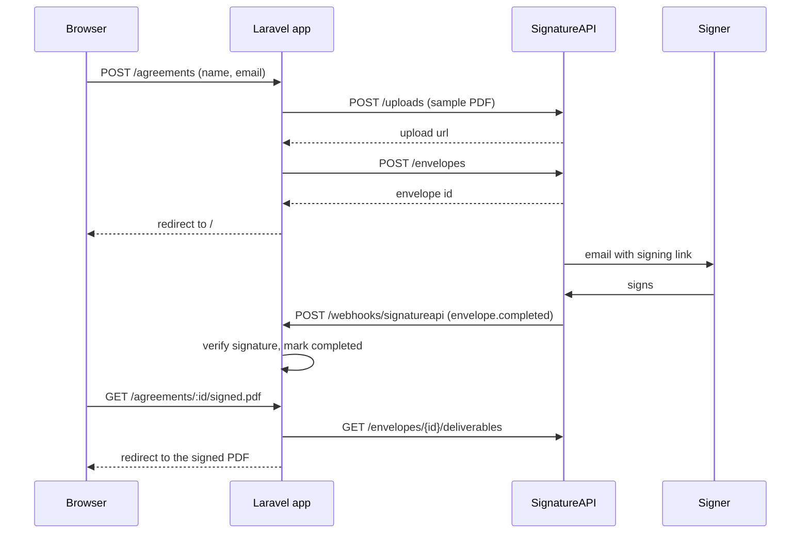

# SignatureAPI Laravel starter

A Laravel template for sending documents for signature with the SignatureAPI e-signature API.

[](docs/media/demo.mp4)

## What it does

- A form takes a signer's name and email.
- The app uploads a sample PDF and creates an envelope. SignatureAPI emails the signer a signing link.
- A webhook marks the agreement completed, rejected, failed or canceled.
- A completed agreement links to its signed PDF.

## Use this template

Select **Use this template** on GitHub, or clone the repo. Then follow the quickstart.

## Quickstart

You need PHP 8.2 or later with the `pdo_sqlite` extension, Composer, Node.js (for the SignatureAPI CLI, run with `npx`) and a SignatureAPI account.

```bash
composer install
cp .env.example .env
php artisan key:generate
php artisan migrate
npx --yes signatureapi init
php artisan serve --port=3000
```

`init` writes a test API key to `.env`. In a second terminal, forward test webhooks to the app:

```bash
npx --yes signatureapi listen --forward-to http://127.0.0.1:3000/webhooks/signatureapi
```

`listen` writes the webhook secret to `.env`. `php artisan serve` notices the change and restarts on its own.

Open http://localhost:3000.

## How it works



The two files to read:

- [`app/Services/SignatureApi.php`](app/Services/SignatureApi.php): the API client. Add places, recipients or envelope options here.
- [`app/Http/Controllers/SignatureApiWebhookController.php`](app/Http/Controllers/SignatureApiWebhookController.php): webhook verification and the event to status map. Add events here.

## AI agents

The SignatureAPI agent skills come preinstalled, pinned to one commit of [signatureapi/skills](https://github.com/signatureapi/skills):

- Claude Code: the SignatureAPI plugin (skills and MCP server), set in `.claude/settings.json`.
- Codex, Cursor, Copilot and others: the same skills in `.agents/skills/`, plus MCP config in `.codex/config.toml` and `.cursor/mcp.json`.

Run `scripts/update-agent-skills.sh <commit-sha>` to move the pin. See [`AGENTS.md`](AGENTS.md) for agent instructions.

## Tests

```bash
php artisan test
vendor/bin/pint --test
```

The tests fake SignatureAPI with `Http::fake()` and sign webhook payloads with a test secret. They need no key.

[`e2e/`](e2e/) holds an end-to-end test that runs against SignatureAPI test mode. It needs your test key and `signatureapi listen`. See [`e2e/README.md`](e2e/README.md).

## Going to production

- Use a live API key.
- Register a real webhook endpoint in the [dashboard](https://dashboard.signatureapi.com) and set its secret as `SIGNATUREAPI_WEBHOOK_SECRET`.
- Add authentication for your users. This template has none.
- Download and store the signed PDF if you need to keep it. Deliverable links expire after one hour.

## License

MIT. See [LICENSE](LICENSE).
